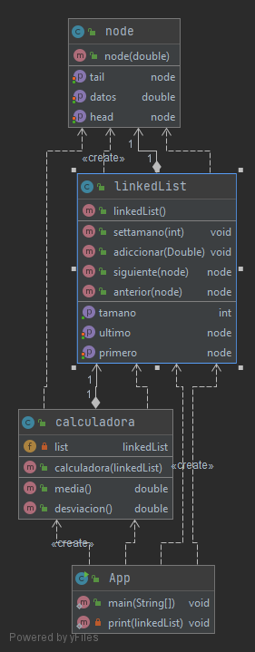
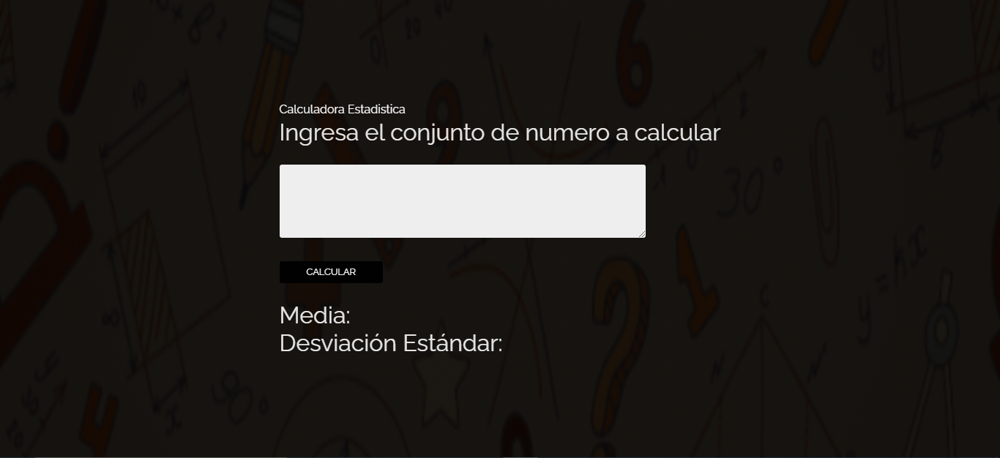
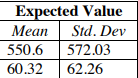
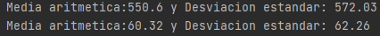

# Calculadora-AREP Taller 1
Tiene como objetivo este programa es calcular la media aritmetica y la desviacion estandar a partir de una lista enlazada que contiene numeros, esta lista se obtiene a traves de un conjunto de datos que el usuario ingresa en la aplicacion web.

## Funcionalidades
La calculadora estadistica implementada, nos ofrece dos funcionalidades a partir de un conjunto de datos, que esta almaneceda en una lista enlazada:
1) Media aritmetica.
2) Desviacion estandar.

## Diseño

## Prerequisitos del sistema
* Maven
* Git
* Java
* Heroku

## Descarga,instalacion y ejecución
Primero debemos clonar el repositorio, como veremos en el siguiente comando:

**git clone https://github.com/johanrueda/CalculatorArep2.0**

Ahora ejecutamos una consola de comandos en el directorio donde fue clonado el repositorio y compilar el proyecto con el siguiente comando:

**mvn package**

Luego ejecutamos el programa con el siguiente comando:

**java -cp target/herokuACalcu-1.0-SNAPSHOT.jar edu.escuelaing.arem.ASE.app.App**

de esta manera la aplicacion corre localmente.

Pero tambien dicha aplicacion tiene un despliegue en heroku que puedes utilizar en cualquier momento.

**LINK HEROKU**

## Pruebas 

Para ejecutar las pruebas basta con un comando sencillo ya que estan automatizadas con el framework JUnit:

**mvn test**

este es el resultado del programa y lo esperado:

## Documentación

Para generar la documentación de Java Doc ejecute el siguiente comando:

**mvn javadoc:javadoc**

## Desarrollo

Este proyecto se desarrollo con:
* Maven
* Java 8
* Intellij IDEA
* Heroku

## Autor

**Johan David Rueda Rodriguez**

## Licencia
Este proyecto lo contiene la licencia GNU GENERAL PUBLIC LICENSE.
